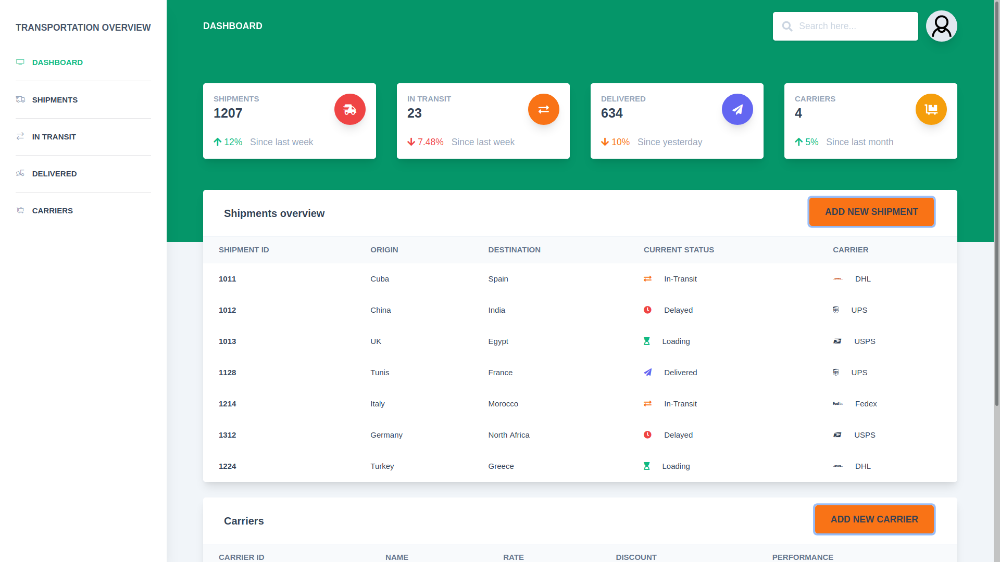

## Description

Dashboard demo for a transportation management system (TMS).

### Project setup

```
npm install
```

#### Compiles and hot-reloads for development

```
npm run serve
```

#### Compiles and minifies for production

```
npm run build
```

#### Lints and fixes files

```
npm run lint
```

#### Customize configuration

See [Configuration Reference](https://cli.vuejs.org/config/).

## Browser Support

Demo supports the last two versions of the following browsers:

| Chrome                                                                                                                             | Firefox                                                                                                                              | Edge                                                                                                                              | Safari                                                                                                                              | Opera                                                                                                                              |
|:----------------------------------------------------------------------------------------------------------------------------------:|:------------------------------------------------------------------------------------------------------------------------------------:|:---------------------------------------------------------------------------------------------------------------------------------:|:-----------------------------------------------------------------------------------------------------------------------------------:|:----------------------------------------------------------------------------------------------------------------------------------:|
|  |  |  |  |  |

#

## Tools used

[Tailwind CSS](https://tailwindcss.com/) <br/> 
[Vue](https://vuejs.org/)
<br/> 

## File Structure

Within the download you'll find the following directories and files:

```
.


```
